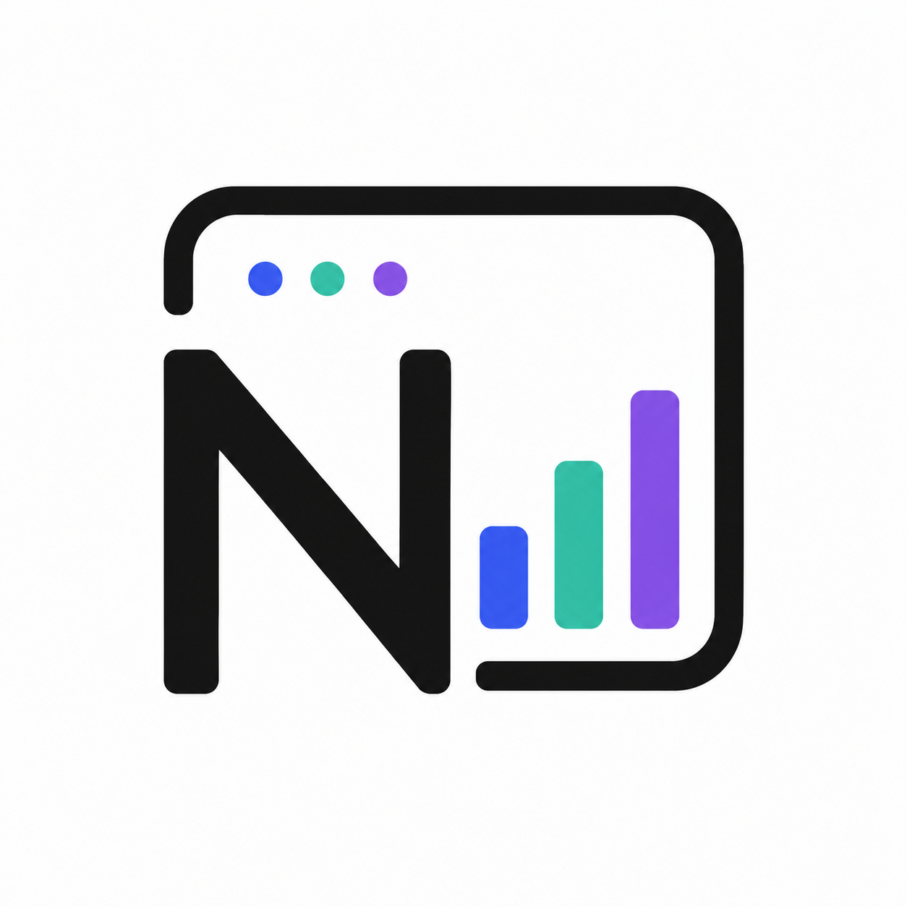
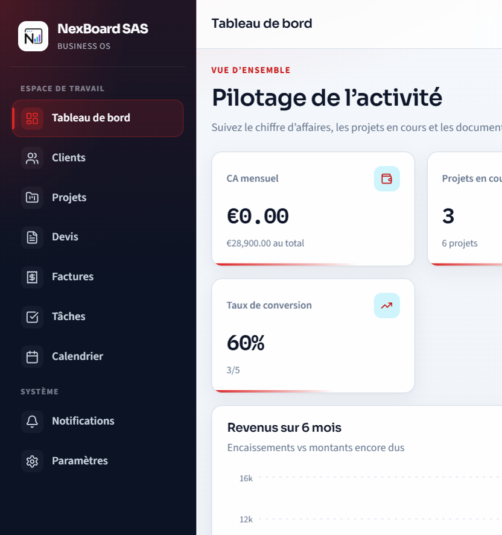
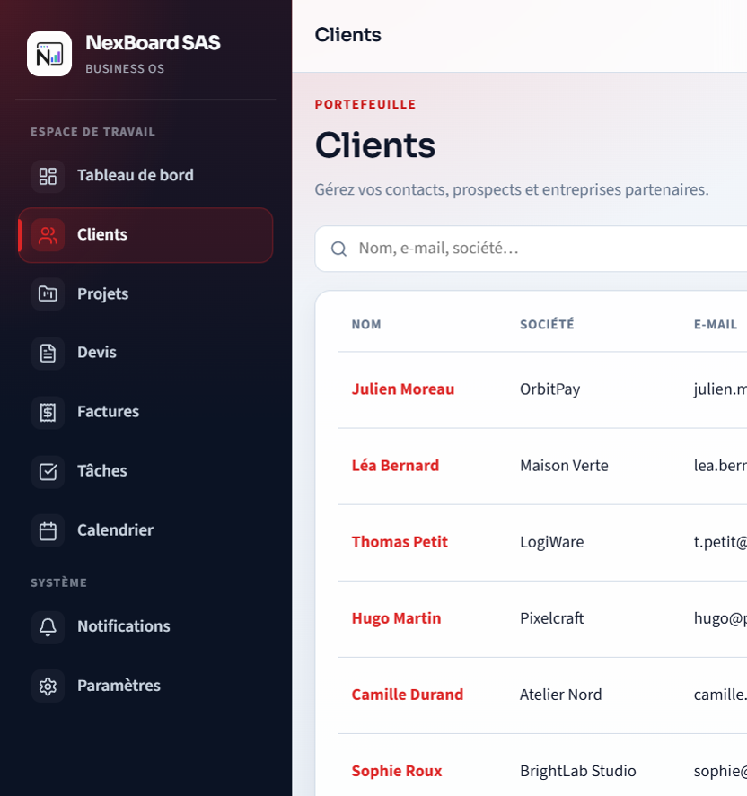
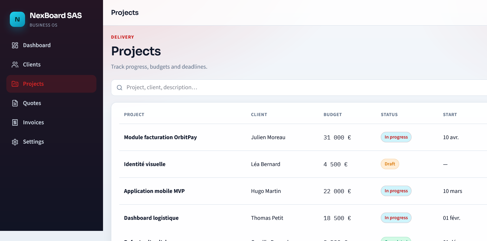
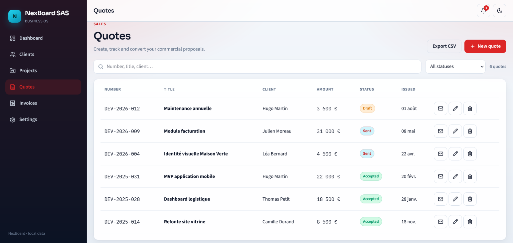
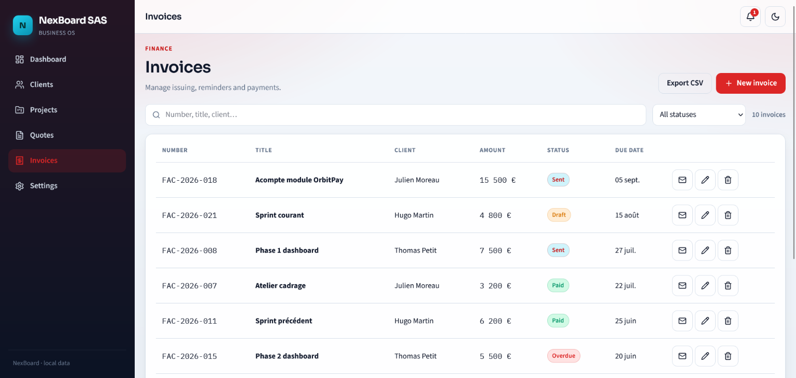

# NexBoard

<p align="center">
  
</p>

<p align="center">
  <strong>Modern, modular and lightweight business management dashboard.</strong><br/>
  <em>Latest release: <a href="https://github.com/nexyrosweb/nexboard/releases/tag/v1.2.0">v1.2.0</a></em>
</p>

<p align="center">
  React • Vite • TypeScript • Node.js • Fastify • SQLite
</p>

<p align="center">
  <a href="https://github.com/nexyrosweb/nexboard/releases"></a>
  <a href="https://www.npmjs.com/package/nexboard"></a>
  <a href="CHANGELOG.md"></a>
  <a href="LICENSE"></a>
  <a href="https://github.com/nexyrosweb/nexboard"></a>
</p>

<p align="center">
  <a href="#-english">English</a> ·
  <a href="#-français">Français</a>
</p>

---

## 🇬🇧 English

### About NexBoard

**NexBoard** is a modern business management dashboard designed to provide a clean, fast and intuitive interface for managing everyday business operations — clients, projects, quotes, invoices, tasks and calendar — in one place.

The project uses a client-server architecture and is designed to remain lightweight, modular and easy to install on Windows, Linux, macOS or a VPS.

### What’s new in v1.2.0

* Customizable dashboard widgets (drag / hide)
* Tasks & reminders + calendar (week/month)
* Smart notification center
* CSV import (clients/projects) with duplicate detection
* Multi-currency, custom statuses, overdue reminders
* PDF attachments on email send + configurable document numbers (`DEV-2026-012`, `FAC - 2026 - 018`)
* Official NexBoard logo & favicon

Full notes: [`CHANGELOG.md`](CHANGELOG.md) · [GitHub Release](https://github.com/nexyrosweb/nexboard/releases/tag/v1.2.0)

### Preview

<p align="center">
  
</p>

> Logo: `docs/images/logo.png` (from *Logo NexBoard - Blanc.png*).

### Features

* 📊 Customizable dashboard (draggable / hideable widgets)
* 👥 Customer management (CRUD)
* 📁 Project management (CRUD)
* ✅ Tasks (due date, priority, assignee, reminders, “today” view)
* 📅 Calendar week/month (invoices, projects, tasks, appointments)
* 🧾 Quotes and invoices (CRUD + email send with PDF attachments)
* 🖨️ Printable document preview (save as PDF via browser)
* 🔁 Convert quote → invoice
* 🔢 Configurable document numbers (quotes / invoices)
* 🗂️ Detail sheets with quick actions
* 📈 Charts and analytics (Recharts)
* 🔎 Search, filters and date-range export
* 📥 CSV import (clients/projects) with preview and duplicate detection
* 💱 Multi-currency support
* 🏷️ Custom statuses per entity
* ⏰ Overdue invoice reminders (in-app + optional email)
* 🌙 Light and dark mode
* 🎨 Logo, brand color and multi-language UI (EN / FR / ES / DE / JA)
* 🔔 Smart notification center
* ✉️ SMTP configuration and test emails
* ⚙️ Application settings
* 📤 CSV export and SQLite backup
* 📱 Responsive interface
* 💾 Local SQLite database (auto-created)
* 🚀 Simple installation (`npm i nexboard` / `npx nexboard`)

### Screenshots

#### Dashboard

<p align="center">
  
</p>

#### Customers

<p align="center">
  
</p>

#### Projects

<p align="center">
  
</p>

#### Quotes

<p align="center">
  
</p>

#### Invoices

<p align="center">
  
</p>

> Screenshots: `Dashboard.png`, `Clients.png`, `Project.png`, `Devis.png`, `Factures.png`.

### Versioning

NexBoard follows [Semantic Versioning](https://semver.org/) (`MAJOR.MINOR.PATCH`).

- Current: **v1.2.0**
- Changelog: [`CHANGELOG.md`](CHANGELOG.md)
- GitHub Releases: https://github.com/nexyrosweb/nexboard/releases

### Tech Stack

#### Frontend

* React
* Vite
* TypeScript
* CSS
* Lucide Icons
* Recharts

#### Backend

* Node.js **22+**
* Fastify
* SQLite (`node:sqlite`)

### Project Structure

```text
nexboard/
├── client/
│   ├── public/
│   ├── src/
│   │   ├── api/
│   │   ├── components/
│   │   ├── context/
│   │   ├── i18n/
│   │   ├── layouts/
│   │   ├── pages/
│   │   ├── styles/
│   │   └── types/
│   └── package.json
│
├── server/
│   ├── bin/
│   ├── src/
│   │   ├── db/
│   │   ├── routes/
│   │   └── services/
│   ├── data/                 # SQLite + uploads (local)
│   └── package.json          # publishable as `nexboard`
│
├── docs/
│   └── images/
│       ├── logo.png
│       ├── Logo NexBoard - Blanc.png
│       ├── Logo NexBoard - Noir.png
│       ├── Dashboard.png
│       ├── Clients.png
│       ├── Project.png
│       ├── Devis.png
│       └── Factures.png
│
├── .env.example
├── .gitignore
├── CHANGELOG.md
├── LICENSE
├── package.json
└── README.md
```

### Installation

#### Requirements

* Node.js **22+**
* npm

#### Quick install (npm)

```bash
npm i nexboard@1.2.0
# or latest
npm i nexboard
```

Or globally:

```bash
npm i -g nexboard
```

Then start NexBoard:

```bash
npx nexboard
```

If installed globally:

```bash
nexboard
```

Open [http://localhost:3001](http://localhost:3001).

#### Install from source (development)

* Git

Clone the repository:

```bash
git clone https://github.com/nexyrosweb/nexboard.git
```

Open the project:

```bash
cd nexboard
```

Install all dependencies:

```bash
npm install
```

### Environment

Create your local environment file from `.env.example`.

Linux / macOS:

```bash
cp .env.example .env
```

Windows (PowerShell):

```powershell
Copy-Item .env.example .env
```

Main variables:

| Variable | Description | Default |
|----------|-------------|---------|
| `PORT` | API / production port | `3001` |
| `HOST` | Listen address (`0.0.0.0` for VPS) | `0.0.0.0` |
| `DATABASE_PATH` | Relative SQLite path (from `server/`) | `./data/nexboard.db` |

### Development

Start NexBoard in development mode:

```bash
npm run dev
```

* UI: [http://localhost:5173](http://localhost:5173)
* API: [http://localhost:3001](http://localhost:3001)

Client and server are managed through npm workspaces.

### Production

```bash
npm run build
npm start
```

### Database

NexBoard uses **SQLite** to keep installation simple and portable.

No external MySQL or PostgreSQL server is required.

The local database is created automatically on first start, with demo data.

### Goals

NexBoard is built around a few core principles:

* Simple installation
* Clean architecture
* Reusable components
* Modular code
* Minimal unnecessary dependencies
* Responsive design
* Easy deployment
* Maintainable codebase

### Roadmap

* [x] Project architecture
* [x] Dashboard interface
* [x] Customer management
* [x] Project management
* [x] Quotes
* [x] Invoices
* [x] Notifications
* [x] SMTP / email sending
* [x] Branding (logo & colors)
* [x] Multi-language UI
* [x] API
* [x] Dashboard customization
* [x] Tasks & reminders
* [x] Calendar view
* [x] CSV import
* [x] Smart notification center
* [x] PDF generation (email attachments + browser print)
* [ ] Authentication
* [ ] User management
* [ ] Roles and permissions
* [ ] Advanced analytics

### Contributing

Contributions, suggestions and feedback are welcome.

You can open an **Issue** to report a bug, suggest an improvement or propose a new feature.

### License

This project is licensed under the **MIT License**.

See the [`LICENSE`](LICENSE) file for more information.

---

## 🇫🇷 Français

### À propos de NexBoard

**NexBoard** est un dashboard moderne de gestion d’entreprise permettant de centraliser les opérations quotidiennes — clients, projets, devis, factures, tâches et calendrier — dans une interface simple, rapide et intuitive.

Le projet utilise une architecture client-serveur et est pensé pour rester léger, modulaire et facilement installable sur Windows, Linux, macOS ou un VPS.

### Nouveautés v1.2.0

* Tableau de bord personnalisable (glisser / masquer)
* Tâches & rappels + calendrier (semaine/mois)
* Centre de notifications intelligent
* Import CSV (clients/projets) avec détection des doublons
* Multi-devises, statuts personnalisés, relances factures
* PDF joint à l’e-mail + numéros de documents configurables (`DEV-2026-012`, `FAC - 2026 - 018`)
* Logo et favicon NexBoard officiels

Notes complètes : [`CHANGELOG.md`](CHANGELOG.md) · [Release GitHub](https://github.com/nexyrosweb/nexboard/releases/tag/v1.2.0)

### Aperçu

<p align="center">
  
</p>

> Logo : `docs/images/logo.png` (issu de *Logo NexBoard - Blanc.png*).

### Fonctionnalités

* 📊 Tableau de bord personnalisable (widgets déplaçables / masquables)
* 👥 Gestion des clients (CRUD)
* 📁 Gestion des projets (CRUD)
* ✅ Tâches (échéance, priorité, responsable, rappels, vue « aujourd’hui »)
* 📅 Calendrier semaine/mois (factures, projets, tâches, rendez-vous)
* 🧾 Devis et factures (CRUD + envoi e-mail avec PDF joint)
* 🖨️ Aperçu document imprimable (PDF via navigateur)
* 🔁 Conversion devis → facture
* 🔢 Numéros de documents configurables (devis / factures)
* 🗂️ Fiches détail avec actions rapides
* 📈 Graphiques et analytics (Recharts)
* 🔎 Recherche, filtres et export par plage de dates
* 📥 Import CSV (clients/projets) avec aperçu et détection des doublons
* 💱 Support multi-devises
* 🏷️ Statuts personnalisables par entité
* ⏰ Relances de factures en retard (in-app + e-mail optionnel)
* 🌙 Mode clair et sombre
* 🎨 Logo, couleur de marque et interface multilingue
* 🔔 Centre de notifications intelligent
* ✉️ Configuration SMTP et e-mails de test
* ⚙️ Paramètres de l’application
* 📤 Export CSV et sauvegarde SQLite
* 📱 Interface responsive
* 💾 Base de données SQLite locale (création auto)
* 🚀 Installation simple (`npm i nexboard` / `npx nexboard`)

### Captures d’écran

#### Tableau de bord

<p align="center">
  
</p>

#### Clients

<p align="center">
  
</p>

#### Projets

<p align="center">
  
</p>

#### Devis

<p align="center">
  
</p>

#### Factures

<p align="center">
  
</p>

> Captures : `Dashboard.png`, `Clients.png`, `Project.png`, `Devis.png`, `Factures.png`.

### Versioning

NexBoard suit le [Semantic Versioning](https://semver.org/) (`MAJOR.MINOR.PATCH`).

- Journal des versions : [`CHANGELOG.md`](CHANGELOG.md)
- Releases GitHub : https://github.com/nexyrosweb/nexboard/releases

### Technologies

#### Frontend

* React
* Vite
* TypeScript
* CSS
* Lucide Icons
* Recharts

#### Backend

* Node.js **22+**
* Fastify
* SQLite (`node:sqlite`)

### Structure du projet

```text
nexboard/
├── client/
│   ├── public/
│   ├── src/
│   │   ├── api/
│   │   ├── components/
│   │   ├── context/
│   │   ├── i18n/
│   │   ├── layouts/
│   │   ├── pages/
│   │   ├── styles/
│   │   └── types/
│   └── package.json
│
├── server/
│   ├── bin/
│   ├── src/
│   │   ├── db/
│   │   ├── routes/
│   │   └── services/
│   ├── data/                 # SQLite + uploads (local)
│   └── package.json          # publiable sous `nexboard`
│
├── docs/
│   └── images/
│       ├── logo.png
│       ├── Logo NexBoard - Blanc.png
│       ├── Logo NexBoard - Noir.png
│       ├── Dashboard.png
│       ├── Clients.png
│       ├── Project.png
│       ├── Devis.png
│       └── Factures.png
│
├── .env.example
├── .gitignore
├── LICENSE
├── package.json
└── README.md
```

### Installation

#### Prérequis

* Node.js **22+**
* npm

#### Installation rapide (npm)

Installez le package :

```bash
npm i nexboard
```

Ou en global :

```bash
npm i -g nexboard
```

Puis lancez NexBoard :

```bash
npx nexboard
```

Si installé en global :

```bash
nexboard
```

Ouvrez [http://localhost:3001](http://localhost:3001).

#### Installation depuis les sources (développement)

* Git

Clonez le dépôt :

```bash
git clone https://github.com/nexyrosweb/nexboard.git
```

Accédez au projet :

```bash
cd nexboard
```

Installez toutes les dépendances :

```bash
npm install
```

### Configuration

Créez votre fichier d’environnement à partir de `.env.example`.

Linux / macOS :

```bash
cp .env.example .env
```

Windows (PowerShell) :

```powershell
Copy-Item .env.example .env
```

Variables principales :

| Variable | Description | Défaut |
|----------|-------------|--------|
| `PORT` | Port API / production | `3001` |
| `HOST` | Adresse d’écoute (`0.0.0.0` pour un VPS) | `0.0.0.0` |
| `DATABASE_PATH` | Chemin relatif SQLite (depuis `server/`) | `./data/nexboard.db` |

### Développement

Lancez NexBoard en mode développement :

```bash
npm run dev
```

* Interface : [http://localhost:5173](http://localhost:5173)
* API : [http://localhost:3001](http://localhost:3001)

Le client et le serveur sont gérés via les npm workspaces.

### Production

```bash
npm run build
npm start
```

### Base de données

NexBoard utilise **SQLite** afin de conserver une installation simple et portable.

Aucun serveur MySQL ou PostgreSQL externe n’est nécessaire.

La base locale est créée automatiquement au premier lancement, avec des données de démonstration.

### Objectifs

NexBoard repose sur plusieurs principes :

* Installation simple
* Architecture claire
* Composants réutilisables
* Code modulaire
* Peu de dépendances inutiles
* Interface responsive
* Déploiement facile
* Code facilement maintenable

### Feuille de route

* [x] Architecture du projet
* [x] Interface du dashboard
* [x] Gestion des clients
* [x] Gestion des projets
* [x] Devis
* [x] Factures
* [x] Notifications
* [x] SMTP / envoi d’e-mails
* [x] Branding (logo & couleurs)
* [x] Interface multilingue
* [x] API
* [x] Personnalisation du dashboard
* [x] Tâches et rappels
* [x] Vue calendrier
* [x] Import CSV
* [x] Centre de notifications intelligent
* [ ] Authentification
* [ ] Export PDF
* [ ] Gestion des utilisateurs
* [ ] Rôles et permissions
* [ ] Statistiques avancées

### Contribution

Les contributions, suggestions et retours sont les bienvenus.

Vous pouvez ouvrir une **Issue** pour signaler un problème, proposer une amélioration ou suggérer une nouvelle fonctionnalité.

### Licence

Ce projet est distribué sous licence **MIT**.

Consultez le fichier [`LICENSE`](LICENSE) pour plus d’informations.

---

<p align="center">
  
</p>

<p align="center">
  Made with ❤️ for NexBoard
</p>
